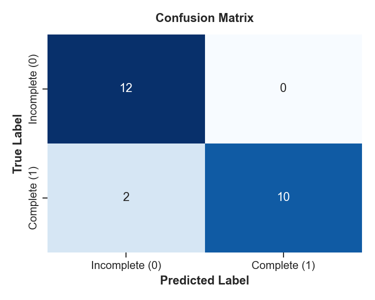
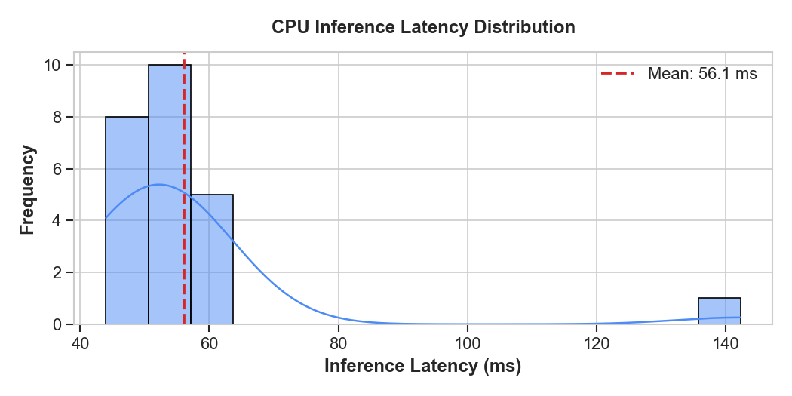

# BERT End-of-Turn Detection (PT-BR)

<p align="left">
  <a href="https://huggingface.co/JamesGuima/bert-end-of-turn-pt">
    
  </a>
  <a href="LICENSE">
    
  </a>
</p>

> A lightweight BERT-based binary classifier that detects end-of-utterance in Brazilian Portuguese chat conversations, acting as a real-time gatekeeper before routing messages to LLMs or answering the user.

> **Model Hub:** Pretrained weights, tokenizer, and evaluation metrics are hosted directly on Hugging Face:  
> [**huggingface.co/JamesGuima/bert-end-of-turn-pt**](https://huggingface.co/JamesGuima/bert-end-of-turn-pt)

**Author:** Jaime Guimarães — UFMG

---

## The Problem

In conversational AI agents for customer service chatbots, knowing when a user has *finished* typing a sentence is harder than it looks:

- **Fixed timeouts (e.g., 3–5 s)** add unnecessary latency to every interaction.
- **Immediate dispatch** of fragmented messages sends incomplete thoughts to LLMs, wasting tokens and degrading response quality.

## The Solution

A fine-tuned `bert-base-portuguese-cased` model that reads an incoming message and returns in milliseconds:

| Label | Meaning |
| :--- | :--- |
| `LABEL_1` | Sentence is **complete** — forward to LLM |
| `LABEL_0` | Sentence is **incomplete** — hold or route to smaller model |

---

## Training

### Dataset

Base dataset: [`RichardSakaguchiMS/brazilian-customer-service-conversations`](https://huggingface.co/datasets/RichardSakaguchiMS/brazilian-customer-service-conversations) — real Brazilian customer service chat logs.

### Data Augmentation

Since real datasets contain only complete sentences, a custom augmentation function (`extract_and_break_smart`) was used to generate negative examples:

- For every customer message with more than 5 words, **3 intentionally cut versions** were generated by randomly truncating between 20%–70% of the words → `LABEL_0`
- The original complete message was kept → `LABEL_1`
- Short chat-specific patterns such as greetings, confirmations, and banking phrases were injected with **20× oversampling** to improve performance on short inputs

### Training Setup

| Parameter | Value |
| :--- | :--- |
| Base model | `neuralmind/bert-base-portuguese-cased` |
| Task | Binary sequence classification |
| Max sequence length | 64 tokens |
| Learning rate | `5e-5` (adaptive, halved on failure) |
| Early stopping | Patience = 2 epochs, metric = `eval_f1` |
| Target metric | F1-score >= 0.85 |

The training loop retries up to 3 times with decreasing LR until the F1 target is met. See [`BERT_END_OF_TURN.ipynb`](./BERT_END_OF_TURN.ipynb) for the full pipeline.

---

## Evaluation

| Metric | Incomplete (0) | Complete (1) | Overall |
| :--- | :---: | :---: | :---: |
| Precision | 0.86 | 1.00 | 0.93 |
| Recall | 1.00 | 0.83 | 0.92 |
| F1-score | 0.92 | 0.91 | 0.92 |
| **Accuracy** | — | — | **92%** |

Mean CPU inference latency: **~56 ms** · P95: **~61 ms**

> Measured on CPU — no GPU required. This is intentional: the model is designed to run as a lightweight gatekeeper on standard infrastructure, without dedicated hardware. The value proposition is precisely that it is cheap enough to run anywhere, while still saving costs on the heavier LLM calls it filters.

### Confusion Matrix



### Latency Distribution



---

## Demo

The repository includes an interactive single-page chat demo with two routing modes. This demo was designed to simulate and show a real use-case of the model, and its value in a wide range of scenarios.

### Mode 1 — Smart Routing

The BERT model classifies each message on send:
- `LABEL_1` (complete) → routes to **large model**
- `LABEL_0` (incomplete) → routes to **small model**

### Mode 2 — Wait & Send

- `LABEL_1` → dispatches to large model immediately
- `LABEL_0` → shows a typing indicator and waits **5 seconds**. If the user stops typing, the message is dispatched to the large model. If the user resumes typing, the timer resets.

A live BERT classification badge updates in the input area as you type.

### Screenshots


### How to Run the Demo

**1. Install dependencies**

```bash
cd app
pip install -r requirements.txt
```

**2. Start the backend**

The model is loaded automatically from Hugging Face on startup.

```bash
cd app
python -m uvicorn main:app --host 0.0.0.0 --port 8000
```

**3. Open the frontend**

Open `frontend/index.html` directly in your browser. No build step required.

> The frontend calls `http://localhost:8000/classify` — make sure the backend is running first.

### API

```
POST /classify
Content-Type: application/json

{ "text": "queria saber sobre o que vocês vendem" }
```

Response:
```json
{ "label": 1, "confidence": 0.9998 }
```

---

## Using the Model Directly

### Via Hugging Face pipeline

```python
from transformers import pipeline

classifier = pipeline(
    "text-classification",
    model="JamesGuima/bert-end-of-turn-pt"
)

classifier("Quero consultar o limite do meu cartão.")
# [{'label': 'LABEL_1', 'score': 0.9998}]

classifier("Eu gostaria de saber sobre o")
# [{'label': 'LABEL_0', 'score': 0.9999}]
```

### Via PyTorch

```python
import torch
from transformers import AutoTokenizer, AutoModelForSequenceClassification

tokenizer = AutoTokenizer.from_pretrained("JamesGuima/bert-end-of-turn-pt")
model = AutoModelForSequenceClassification.from_pretrained("JamesGuima/bert-end-of-turn-pt")
model.eval()

def is_end_of_turn(text: str) -> dict:
    inputs = tokenizer(text, return_tensors="pt", truncation=True, max_length=64)
    with torch.no_grad():
        probs = torch.softmax(model(**inputs).logits, dim=-1)
        label = int(torch.argmax(probs).item())
        confidence = float(probs[0][label].item())
    return {"is_complete": bool(label == 1), "confidence": confidence}

is_end_of_turn("preciso cancelar meu plano")
# {'is_complete': True, 'confidence': 0.9997}

is_end_of_turn("eu queria cancelar o meu")
# {'is_complete': False, 'confidence': 0.9991}
```

---

## License

MIT
